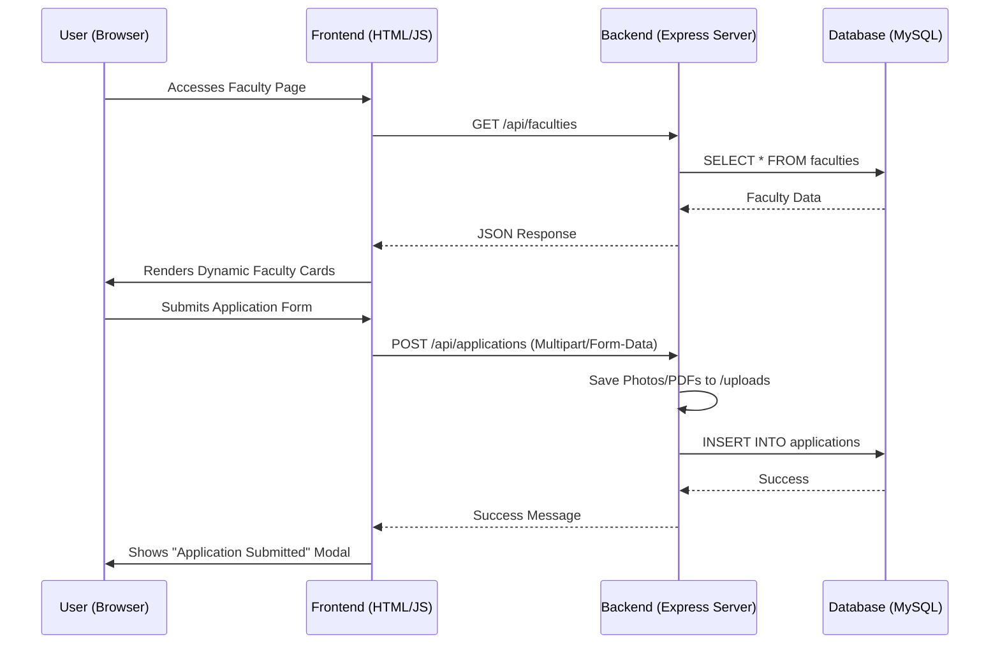
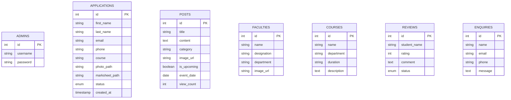

# Vijay University Web Portal - Complete Technical Report

## 1. System Flow Diagram
This diagram illustrates how a user request flows through the system, from the browser to the database and back.

## 2. Database Schema Diagram (ERD)
Visual representation of the database tables and their structure.

## 3. Technology Stack

### 3.1 Frontend (User Interface)
- **HTML5 & CSS3**: Core structural and styling languages for a modern web experience.
- **Bootstrap 5.3.2**: A powerful CSS framework used for responsive layout, grid systems, and pre-built UI components.
- **Vanilla JavaScript (ES6+)**: Used for all client-side logic, including dynamic data fetching via the `fetch()` API and DOM manipulation.
- **Bootstrap Icons**: Provides a comprehensive set of high-quality icons for the interface.
- **Google Fonts**: Integrates 'Inter' and 'Outfit' typefaces to achieve a premium, professional aesthetic.
- **Google Translate API**: Enables real-time language translation for international accessibility.

### 3.2 Backend (Server Logic)
- **Node.js**: The primary runtime environment for the application server.
- **Express.js**: A minimalist web framework for Node.js used to build the robust RESTful API.
- **JWT (JSON Web Tokens)**: Implements secure, stateless authentication for the admin dashboard.
- **Bcrypt.js**: Ensures security by hashing administrator passwords before storage.
- **Multer**: Specialized middleware for handling `multipart/form-data`, primarily used for uploading student photos and marksheets.
- **CORS**: Configured to allow secure cross-origin requests between the frontend and the API.
- **Dotenv**: Securely manages sensitive environment variables like database credentials and JWT keys.

### 3.3 Database & Storage
- **MySQL**: A reliable relational database management system used to store all university data (courses, applications, news, etc.).
- **mysql2**: A high-performance MySQL driver for Node.js.
- **File System Storage**: Student documents and images are organized and stored securely in the server's local file system.

## 4. How the Site Works

### 4.1 Frontend (The "View")
The frontend consists of highly optimized HTML5 files. 
- **Dynamic Loading**: Pages like `index.html`, `faculty.html`, and `news.html` use the `fetch()` API to pull data from the backend. This means the content changes instantly when updated in the admin panel without editing any HTML files.
- **Client-Side Validation**: Forms like `apply.html` have built-in checks to ensure all required data is entered before submission.
- **Responsive Design**: Uses Bootstrap 5 and custom CSS (`style.css`) to ensure the site looks premium on both mobile and desktop.

### 4.2 Backend (The "Brain")
The `backend/server.js` file is the heart of the application:
- **API Engine**: It handles all incoming requests (GET, POST, PUT, DELETE).
- **Authentication**: When an admin logs in, they receive a "passport" (token) that must be sent with every subsequent request.
- **File Management**: Automatically organizes uploads into folders like `/uploads/photos` and `/uploads/marksheets`.

### 4.3 Database (The "Memory")
MySQL stores all the structured data.
- **Persistence**: Even if the server restarts, your data remains safe in the `university_db`.
- **Real-time Updates**: The status of applications and reviews can be toggled by the admin, reflecting immediately on the public site.

## 5. Operational Flow (Run All)
The `run_all.ps1` script automates the environment setup:
1. **Node Environment**: Checks for `node_modules` and installs dependencies if missing.
2. **FileSystem**: Creates `uploads/` directories automatically.
3. **Execution**: Spawns the server in a persistent terminal window.
4. **Initialization**: Offers a one-click "Seed" option to populate the database with 70+ courses and sample faculty data.

## 6. Site Map (Navigation Structure)
A visual sitemap has been created at `sitemap.html` to help users and search engines navigate the university structure, including all department microsites.
